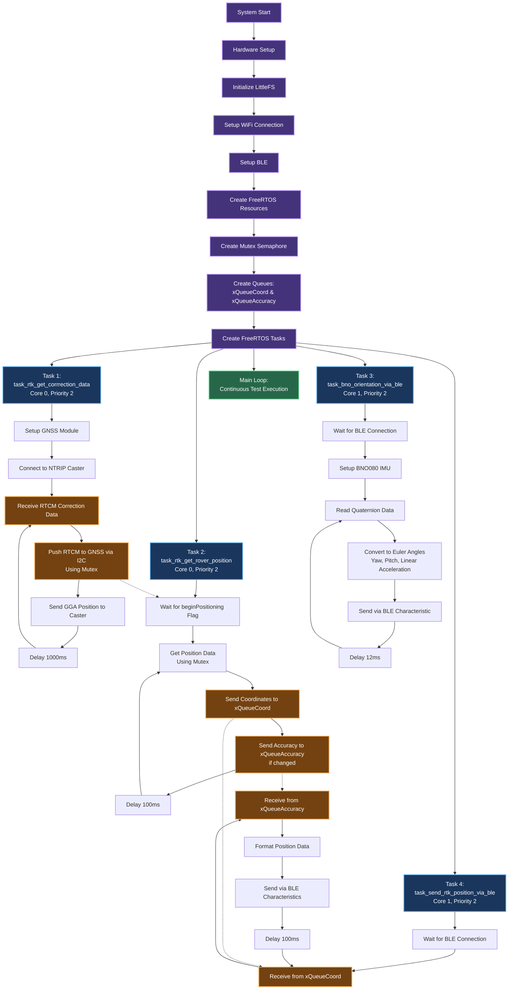

# RWA RTK Rover

## Key Aspects of the Task Scheduling

### FreeRTOS Configuration

- 4 concurrent tasks running on a dual-core ESP32
- Core 0: RTK correction data and position tasks (WiFi/GNSS heavy)
- Core 1: BLE communication tasks (IMU and position transmission)
- All tasks have Priority 2 (equal priority with time-slicing)

### Task Timing

- `task_rtk_get_corrrection_data`: 1000ms intervals
- `task_rtk_get_rover_position`: 100ms intervals
- `task_bno_orientation_via_ble`: 12ms intervals (fastest - for head tracking)
- `task_send_rtk_position_via_ble`: 100ms intervals

### Inter-Task Communication

- Mutex Semaphore: Protects shared GNSS resources
- Two Queues:
  - `xQueueCoord`: Position coordinates
  - `xQueueAccuracy`: Position accuracy data
- Global Flag: `beginPositioning` - synchronizes position reading with correction data availability

### Task Dependencies

- Task 1 must establish RTCM correction stream before Task 2 begins positioning
- Tasks 3 & 4 wait for BLE connection before operation
- Task 4 consumes data produced by Task 2 via queues
- This architecture ensures real-time head tracking (~12ms) while maintaining accurate RTK positioning and reliable wireless communication.

## Flowchart

