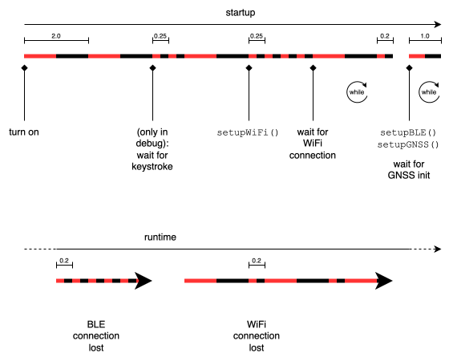

# RTKRover

## Headtracker + Real Time Kinematics (RTK rover)


Hardware used:

* Adafruit Feather ESP32 Huzzah
* SparkFun GPS-RTK-SMA Breakout - ZED-F9P (Qwiic)
* SparkFun BNO080 Breakout
* Ardusimple [Compact Helical Tripleband GNSS Antenna
](https://www.ardusimple.com/product/compact-helical-gnss-tripleband-l-band-antenna-ip67/)
* LiPo battery
* Resistor 10 k
* Switch

Infrastructure:

* WiFi (e. g. a personal hotspot)
* free line of sight between antenna (horizontal placed) an sky

Naming convention (the full glossary is PROJECT-PLAN.md §1.1):

* **Headset assembly** (*assembly*) = the headtracker, what you wear:
  headphones + microphone + ESP32 board + LiPo cell + BNO080 IMU breakout
  + ZED-F9P breakout + antenna. This firmware makes it the **RTK headtracker**;
  the sibling firmware RWAHT (`../rwa-headtracker`) makes a plain headtracker.
  Its **assembly label** is its BLE name and its sticker, e.g. `rwa-hs-2`.
* **Board** = the bare ESP32 Feather; only a flashing-time concept
  (CP2104 serial ↔ assembly label in `tools/known-boards.txt`).
* **Unit** = what you carry with you during the soundwalk: assembly + phone
  + accessories. The **unit label** (`rwa-hs-N`) is the phone's name and
  hotspot SSID and the `device_id` in telemetry; by convention it equals the
  assembly label.
* **Rover** is the RTK role of the GNSS receiver (corrected against the
  refnet reference station), not a name for the hardware. It survives in
  the firmware name *rtk-rover* only.

### Dependencies (currently not in use)

* [ESPAsyncWebServer](https://github.com/me-no-dev/ESPAsyncWebServer)
* [RTKRoverManager](https://github.com/jangleboom/RTKRoverManager)

### Circuit diagram


### Configuration

BNO080:

In [`main.cpp`](./src/main.cpp) line 763 (or near) you can choose the way of sensor fusion in the BNO080.

```cpp
// Activate IMU functionalities
// bno080.enableRotationVector(BNO080_ROT_VECT_UPDATE_RATE_MS);
// bno080.enableGameRotationVector(BNO080_ROT_VECT_UPDATE_RATE_MS);
bno080.enableARVRStabilizedRotationVector(BNO080_ROT_VECT_UPDATE_RATE_MS);
```

more information in the [datasheet](https://www.ceva-dsp.com/wp-content/uploads/2019/10/BNO080_085-Datasheet.pdf)

ZED-F9P:

Caster and WiFi credentials live in `tools/fleet-secrets.ini` (gitignored; copy
from `tools/fleet-secrets_example.ini`), keyed by the assembly labels from
`tools/known-boards.txt`. At build time `tools/gen_caster_secrets.py` generates
`src/CasterSecrets.h` from them for the selected assembly. Set it with the
`RTK_BOARD` env var (label or CP2104 serial), or just have exactly one known
board attached. Do not edit the generated header by hand.

```ini
[caster]
host = rtk2go.com
port = 2101
mount = YOUR_MOUNT_POINT
pass =

[rwa-hs-1]
caster_user = YOUR_CASTER_USER_01
wifi_pw = HOTSPOT_PASSWORD_OF_UNIT_1
```

The WiFi SSID equals the assembly label (the unit's phone hotspot is named
after it); `wifi_ssid` in an assembly section overrides that. The BLE name also
equals the assembly label, but falls back to `rtkrover-<chip-id>` if no
corresponding assembly section exists in fleet-secrets.ini.

The mklittlefs file in the root dir you have to [get](https://github.com/earlephilhower/mklittlefs/releases) depending on your OS.
If you have the Arduino IDE installed, you can borrow it from there too. On macOS you can find it here: `~/Library/Arduino15/packages/esp32/tools/mklittlefs/3.0.0-gnu12-dc7f933/mklittlefs`.  Help for setup the file system you can find [here](https://randomnerdtutorials.com/esp8266-nodemcu-vs-code-platformio-littlefs/). This project was created on macOS (silicon).

[Support RTK2GO](http://new.rtk2go.com/donations-and-support/)

### PlatformIO

Update the serial-port paths in [`platformio.ini`](./platformio.ini) to the values read from PlatformIO "Devices" command (`platformio device list`).

### ESP32 board (red) LED codes



> **Stale:** the diagram still shows the old startup order (`setupWiFi()`
> → "wait for WiFi connection" → `setupBLE()`). The list below is current; the
> diagram needs re-exporting from its draw.io source.

#### Startup

* 1.0s 2x: started setup (blocking)
* 0.125s 2x 1.0s 1x (watch for this to spot reboots) (blocking)
* `setupBLE` no blinking. unit is now discoverable
* `setupWiFi`
* 0.125s 4x (blocking, after the single WiFi connection attempt)
* `setupGNSS`
  * while myGNSS.begin
    * 0.5s: setupGNSS() failed (I2C setup) (blocking)
* FreeRTOS queues and tasks setup

`setupWiFi()` makes one bounded attempt and setup continues regardless. A
missing hotspot is handled at runtime by `task_rtk_get_corrrection_data` (its
1.0s/0.1s pattern below), so that blink code now also means "booted before the
hotspot was up", not only "lost it".

#### Runtime

> legacy, check if still applicable
>
> * 1.0 s RTK: setupGNSS() failed (I2C communication)
> * 2.0 s RTK: credentialsExists false

`task_rtk_get_corrrection_data`

* no credentials (needs to removed)
* while wait for WiFi Connection
  * 1.0s, 0.1s: connection to AP lost (blocking)

`task_send_rtk_position_via_ble`

* while (!bleConnected)
  * 0.1s (non-blocking)
* when not connected in while-loop
  * 3x 0.1s, 1.0s wait

### ESP32 board (yellow) LED codes

* flashing: running on USB power
* steady: Charging
* off: fully charged
